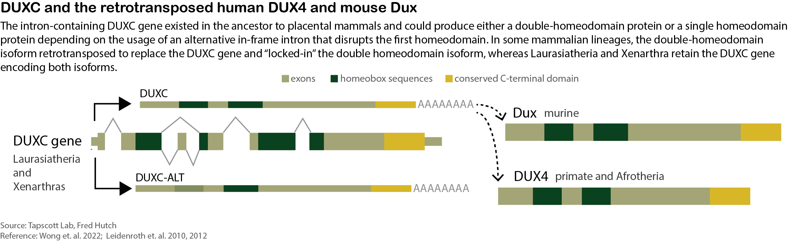

# Preface {-}

```{r duxc-summary, echo=FALSE, include=TRUE, fig.cap="The gene models of the ancestral double homeodomain gene DUXC and its alternative isoform DUXC-ALT in relation to the retrotransposed human DUX4 (hDUX4) and murine Dux (mDux)."}
                        
```

To support the reproducibility and transparency of the computational work for the manuscript, [_Canine DUXC: Implications for DUX4 retrotransposition and preclinical models of FSHD_](https://academic.oup.com/hmg/advance-article/doi/10.1093/hmg/ddab352/6457948), we made this repository to include our processed RNA-seq and ChIP-seq datasets, as well as a [__book__](https://fredhutch.github.io/canFam3.DuxFamily/) containing nine chapters demonstrating all the bioinformatic analysis and automatically executable R code (you can directly run the code and reproduce the statistics and figures in the manuscript).

Note that certain sections of the code may be hidden from view due to their length and tediousness, but can be accessed through the [Rmd source files](https://github.com/FredHutch/canFam3.DuxFamily/tree/master/gitbook).

## Nomenclature
```{r nomenclature-table, echo=FALSE, message=FALSE}
suppressPackageStartupMessages(library(dplyr))
suppressPackageStartupMessages(library(kableExtra))
data.frame(
  nomenclature=c("CinC", "HinC", "CALTinC", "HinH", "HinM", "MinM"),
  model=c("DUXC in canine", "hDUX4 in canine", "DUXC-ALT in canine", 
          "hDUX4 in human", "hDUX4 in mouse", "mDux in mouse")) %>% 
  kableExtra::kbl(caption="The nomenclatures used in this book.") %>%
  kableExtra::kable_styling()
```

## Datasets

Within the [data](https://github.com/FredHutch/canFam3.DuxFamily/tree/master/data) folder of the repository, we have included `DESeqDataSet` instances that contain read counts for DUXC, DUXC-ALT, human DUX4 (hDUX4), and murine Dux (mDux), as well as their corresponding repeat elements expression and metadata. Additionally, the folder contains results from the ChIP-seq peaks calling in the form of `GRanges`. 

The raw canine RNA-seq data has been deposited to GEO, and can be accessed through the series number [GSE188928](https://www.ncbi.nlm.nih.gov/geo/query/acc.cgi?acc=GSE188928).

There are three categories of datsets:

- DUX4, DUXC, and DUX-ALT transcriptome ([GSE188928](https://www.ncbi.nlm.nih.gov/geo/query/acc.cgi?acc=GSE188928)) in canine skeletal muscle and repeat elements expression stored in DESeqDataSet instances
```
├── CALTinC.ens.dds.rda: DUXC-ALT transcriptome in canine skeletal muscle
├── CinC.ens.dds.rda: DUXC transcriptome
├── HinC.ens.dds.rda: DUX4 transcriptome in canine skeletal muscle
├── rmsk.dds.rda: DUX4, DUXC, DUXC-ALT repeat elements expression
├── CinC_rmsk.rda: DUXC repeat elements DESeq2 results
├── HinC_rmsk.rda: DUX4 repeat elements DESeq2 results
├── CALTinC_rmsk.rda: DUXC-ALT repeat elements DESeq2 results
```

- human DUX4 transcriptome in human myoblast ([GSE85461](https://www.ncbi.nlm.nih.gov/geo/query/acc.cgi?acc=GSE85461)) and mouse Dux transcriptome in mouse myoblast cell lines ([GSE87282](https://www.ncbi.nlm.nih.gov/geo/query/acc.cgi?acc=GSE87282))     
```
├── C2C12.ens.ddsl2.rda: DUX and DUX4 transcriptome in mouse myoblast cell lines
├── HinH.ens.dds.rda: DUX4 transcriptome in human myoblast
├── HinH_rmsk.rda: repeat element expression in HinH transcriptome (DESeq2 results)
```

- miscellaneous. The orthologues are collected from Ensembl horology database V88.   
```
├── human_cleavage.rda: Hendrikson 2017 zygotic activation gene set
├── canine_human_mouse_ensOrtholog.rda: human-canine and mouse-canine 
    paired orthologues 
├── human_mouse_ensOrtholog.rda: human-mouse paired Orthologue
├── peaks_list.rda: ChIP-seq peaks 
├── chipseq_si.rda: ChIP-seq sample information
└── z4_ensembl.rda: Akiyama 2015 2C-like gene set from 
```

## Annotation

### canFam3 ensembl GTF
We used Bioconductor's _AnnotationHub_ package to extract canFam3 ensembl's GTF file and built a `TxDb` (transcript database) annotation package. The code chunk below is an example of how to build a `TxDb` package using the `AnnotationHub` and `GenomicFeatures` packages.

```{r build-TxDb-pkg, message=FALSE, eval=FALSE}
# example:
library(AnnotationHub)
library(GenomicFeatures)
ah = AnnotationHub()
query(ah, c("canFam3", "ensembl"))
gr <- ah["AH79003"] ## download Canis_familiaris ensembl version 99

## construce a meata data.frame
md <- 
  data.frame(name=c("ensembl_version", "Data source", 
                    "Organism", "Resource URL", "Type of Gene ID"),
             value=c("canFam3.1.99", "AnnotationHub query AH79003", 
                     "Canis familiaris ", "http://ensembl.org", 
                     "Ensembl Gene ID"))
txdb <- GenomicFeatures::makeTxDbFromGRanges(gr, metadata=md)
makeTxDbPackage::makeTxDbPackage(
  txdb=txdb, version="1.0.0",
  pkgname="TxDb.Cfamiliaris.CanFam3.ensGene",
  maintainer="Chao-Jen Wong <cwon2@fredhutch.org>",
  author="Chao-Jen Wong",
  destDir="~/tapscott/canfam3")
```

## Software
R/3.6.3, tidyverse and Bioconductor (v3.10) packages